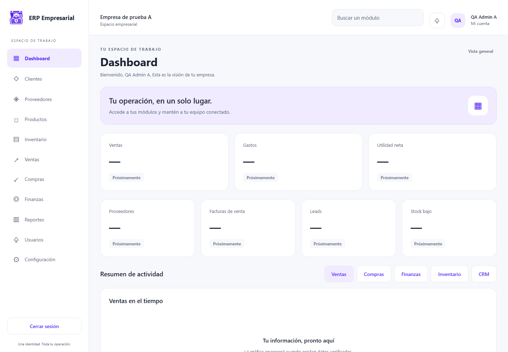

# ERP Empresarial

Monorepo TypeScript con API Express/Mongoose y una interfaz compartida en React Native y React Native Web.

**Estado al 2026-09-29:** CORE HARDENING. Login, sesiones, usuarios, roles, empresas y sucursales tienen operaciones reales y pruebas con MongoDB temporal. Los módulos empresariales pendientes devuelven HTTP 501. La nueva interfaz web y el preview móvil compilan; el host Android está creado, pero APK/AVD no fueron verificados. iOS y Atlas tampoco fueron verificados. Ningún módulo está QA_APPROVED.

El [ERP SOFTWARE AUDIT REPORT](docs/ERP-SOFTWARE-AUDIT-REPORT.md) contiene los hallazgos, correcciones, matriz de estados, evidencia y límites. Las credenciales MongoDB que estuvieron en el historial de Git deben rotarse antes de desplegar.

## Instalación y desarrollo

Requisitos: Node.js y npm compatibles con las dependencias del lockfile; ejecución verificada con Node 24.21.0. MongoDB de desarrollo para usar la API. Ejecuta desde la raíz de este repositorio:

```powershell
npm install
if (!(Test-Path .env)) { Copy-Item .env.example .env }
# Edita .env con tu base de desarrollo y dos secretos JWT aleatorios y distintos.
npm run build
npm run backend:dev
```

En otra terminal:

```powershell
npm run web:dev
```

Web: http://127.0.0.1:5173. API: http://127.0.0.1:3000/api/v1. Vite envía /api al backend mediante proxy; no hace falta publicar las credenciales de MongoDB en el frontend. VITE_API_BASE_URL permite cambiar la URL pública de la API. CORS_ORIGIN debe coincidir con el origen real cuando se accede directamente entre orígenes.

.env permanece local e ignorado; .env.example contiene valores ficticios que deben reemplazarse. En producción se validan secretos JWT distintos, de al menos 32 caracteres, sin marcadores de ejemplo. El servidor no está preparado para arrancar con los valores ficticios.

Para crear una cuenta de desarrollo, configura SEED_ADMIN_EMAIL y SEED_ADMIN_PASSWORD (mínimo 12 caracteres, máximo 72 bytes UTF-8, mayúsculas, minúsculas y números) y ejecuta:

```powershell
npm run db:seed -w backend
```

El seed crea empresa, sucursal, rol empresarial y administrador; excluye permisos de plataforma y rechaza NODE_ENV=production. No crea productos ni stock y no fue ejecutado contra una instalación existente.

## Estructura y arquitectura

```text
apps/web/              entrada web y pruebas Playwright
apps/mobile/           entrada React Native y preview web con Vite
backend/src/           rutas, middleware, servicios, repositorios y modelos
backend/tests/         Jest, Supertest y MongoDB temporal
packages/api-client/   contratos HTTP, refresh y sesión en memoria
packages/session/      AuthProvider compartido
packages/ui/           tokens, logo, layout, pantallas y componentes
packages/types/        tipos y catálogo de permisos
docs/                  auditoría, estado, arquitectura, seguridad y QA
patches/               compatibilidad Metro / image-size
```

Frontend → REST /api/v1 → Express → controladores → servicios/repositorios → Mongoose → MongoDB. Auth/Users siguen esas capas; Roles/Companies/Branches aún consultan modelos desde controladores. Consulta [arquitectura real](docs/architecture/ARCHITECTURE.md).

## UI / Branding

El logo oficial de castor, baúl y cerradura conserva su proporción cuadrada. Se optimizó a PNG de 512 × 512 para UI y 128 × 128 para favicon. ERPLogo ofrece tamaños sm, md y lg. El activo compartido está en packages/ui/src/assets/logo/logo.png.

El design system centraliza #602CF5, fondos claros, tarjetas blancas, bordes, estados, tipografía, radios y espaciado. Web y Mobile usan la misma aplicación, sesión, login, dashboard y pantalla de usuarios. Desktop tiene sidebar fija; tablet, sidebar compacta; móvil, navegación inferior y menú de módulos. Los cortes son 768 y 1100 píxeles.

El dashboard prepara siete KPI y cinco categorías de gráficas. Muestra “Próximamente” cuando el backend responde 501; no presenta ceros ni tendencias ficticias. Productos, clientes e inventario muestran su disponibilidad real.



[Login desktop](docs/qa/screenshots/login-desktop.png) · [Dashboard móvil](docs/qa/screenshots/dashboard-mobile.png) · [Formulario móvil](docs/qa/screenshots/user-form-mobile.png)

Las capturas usan una empresa y cuentas ficticias almacenadas únicamente en MongoDB temporal de QA. Son evidencia de interfaz, no datos productivos.

## Seguridad y API

- JWT de acceso y refresh con tipo y sid; sesión activa comprobada en cada petición.
- Refresh rotatorio mediante actualización atómica de un documento; logout revoca ambos tokens.
- RBAC vigente consultado en backend, aislamiento por empresa y referencias de rol/sucursal validadas.
- Permisos platform.* requieren una cuenta de plataforma aprovisionada fuera de la API empresarial.
- Tokens frontend solo en memoria: recargar o cerrar la app exige iniciar sesión de nuevo.
- Auditoría redactada; la persistencia de eventos aún es de mejor esfuerzo.

Rutas reales: /auth/login, /auth/refresh, /auth/logout, /users, /roles, /companies y /branches. Listados: {success, data, pagination}. Errores: {success:false, error:{code,message}}. Los módulos pendientes responden 501 NOT_IMPLEMENTED después de autenticación.

GET /health comprueba Express; no acredita que MongoDB esté disponible. No hay recuperación de contraseña ni MFA funcionales.

## Pruebas y builds

```powershell
npm run build
npm run lint
npm run format:check
npm run test -- --runInBand --silent
npm run test:unit -- --runInBand --silent
npm run test:integration -- --runInBand --silent
npm run test:e2e
```

El build raíz compila paquetes/backend y genera bundles web de ambas apps; no produce APK/IPA. El preview móvil se inicia con npm run mobile:web. El host Android de React Native vive en apps/mobile/android; iOS aún no tiene proyecto nativo.

## Android Studio / Android Emulator

La app usa React Native 0.73.11 y la plantilla Android de esa versión: Gradle 8.3, AGP 8.1.1, Kotlin 1.8.0, compileSdk/targetSdk 34 y minSdk 21. Usa **JDK 17** para Gradle (selecciónalo en Android Studio > Settings > Build Tools > Gradle). Instala desde SDK Manager Android SDK Platform 34, Build Tools 34.0.0, NDK 25.1.8937393, Android SDK Platform Tools y Android Emulator.

Abre `apps/mobile/android` en Android Studio y deja terminar Gradle Sync. En Tools > Device Manager crea un Pixel 7 u 8 con una imagen Android API 34 y arráncalo. Desde la raíz del repositorio, ejecuta en terminales separadas:

```powershell
npm install
npm run backend:dev
npm run mobile:start
npm run mobile:android
```

Configura antes el `.env` local y una cuenta de desarrollo, según la sección de instalación. También puedes usar Run en Android Studio con Metro activo. El Android Emulator alcanza el backend del equipo en `http://10.0.2.2:3000/api/v1`; el preview web conserva su proxy `/api/v1`. HTTP local se permite únicamente en la variante debug. La variante release requiere una URL HTTPS real y firma privada antes de distribuirse.

Para compilar directamente: `cd apps/mobile/android; .\gradlew.bat assembleDebug`. Si Metro no conecta, comprueba el puerto 8081; si la API no conecta, comprueba el backend en el puerto 3000 y `10.0.2.2`. Consulta la [guía Android](docs/mobile/ANDROID-SETUP.md) para arquitectura, Logcat, depuración y problemas frecuentes.

Para preparar E2E la primera vez:

```powershell
$env:PLAYWRIGHT_BROWSERS_PATH = Join-Path (Get-Location) 'node_modules/.cache/ms-playwright'
npx playwright install chromium
node backend/scripts/cache-test-mongo.cjs
npm run build
npm run test:e2e
```

Los servidores E2E usan puertos 3081, 4173 y 4174 y una base efímera aislada. No usan la URI Atlas de .env. npm install aplica el parche Metro que permite image-size 2.0.4; una prueba carga el logo mediante el lector real de assets.

Resultados y límites: [verificación](docs/QA-VERIFICATION.md), [estrategia QA](docs/qa/QA-STRATEGY.md), [seguridad](docs/security/SECURITY.md), [dependencias](docs/qa/DEPENDENCY-AUDIT.md).

## Continuación

[Estado por módulo](docs/DEVELOPMENT-STATUS.md) y [siguiente fase](docs/NEXT-STEPS.md). Antes de MASTER DATA HARDENING deben cerrarse rotación de secretos históricos, migraciones e integridad de auditoría. Después: Categories → Units → Customers → Suppliers → Warehouses → Products.
