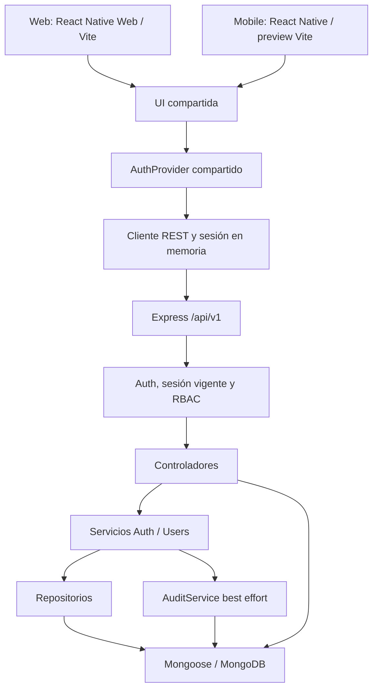

# Arquitectura del ERP

Actualizado: 2026-09-28. Esta página diferencia el código existente del diseño objetivo. Estado: [auditoría](../ERP-SOFTWARE-AUDIT-REPORT.md).

## Arquitectura real

Auth/Users pasan por servicios/repositorios. Roles, Companies y Branches aún acceden directamente a modelos desde controladores. Se deben extraer sus reglas gradualmente; el diagrama no promete separación estricta ya conseguida.

app.ts crea Express sin abrir listener ni conectarse a DB. server.ts valida entorno, conecta Mongo y gestiona el ciclo de vida. GET /health es una comprobación HTTP, no readiness de DB.

## Paquetes

| Paquete                         | Responsabilidad real                                                    |
| ------------------------------- | ----------------------------------------------------------------------- |
| @erp/types                      | Contratos heredados y catálogo de permisos                              |
| @erp/api-client                 | Axios, envelope, errores, refresh deduplicado y store en memoria        |
| @erp/session                    | AuthProvider/useAuth compartidos                                        |
| @erp/ui                         | Tokens, ERPLogo, componentes, aplicación y pantallas                    |
| constants / config / validation | Recursos compartidos heredados; revisar consumidores al ampliar negocio |

No hace falta un state manager adicional para la sesión actual. El UI no decide permisos ni reglas contables. El cliente no contiene credenciales MongoDB.

## Seguridad y tenants

Actor autenticado: userId/companyId/roleId/sid. La firma JWT no basta: usuario, rol, empresa y sesión deben estar activos en cada petición. Permisos se obtienen del rol vigente.

BaseRepository requiere empresa y schema con companyId; impone scope al consultar/modificar. Company es la raíz empresarial y se comprueba el ID contra el actor. Referencias de roles/sucursales deben ser del tenant. No es un mecanismo de autorización por almacén ya implementado.

La rotación refresh hace CAS de tokenHash en el mismo documento Session. No implica una transacción de todas las operaciones de negocio. AuditService sigue siendo best effort; outbox/transacción es una condición de cierre del Core.

## Builds y plataformas

npm run build incluye TypeScript de todos los paquetes/backend/apps y bundles de navegador web/mobile. Vite resuelve react-native a react-native-web, archivos .web primero y safe-area-context sin prebundle de Flow nativo. /api se envía por proxy al backend de desarrollo.

Native utiliza entry point propio y módulos React Native. Faltan proyectos Android/iOS completos y pipeline de release. El directorio Kotlin heredado no acredita un build Android.

image-size 2.0.4 elimina la versión vulnerable anterior. patches/metro+0.80.12.patch adapta require/API y lectura de archivo en Metro; npm install lo reaplica y una prueba carga el PNG real. Mantener/eliminar el parche al migrar Metro, sin ignorar un fallo de postinstall.

## Diseño objetivo y límites

Los módulos futuros deben seguir routes → controller → service → repository → Mongoose. No están implementados por aparecer en un modelo. Los 16 schemas sin companyId y las migraciones requieren corrección antes de habilitar catálogos.

Inventario será un libro de movimientos; ventas/compras/finanzas se apoyarán en transiciones y consistencia documentada. Se requieren idempotencia, observabilidad, transacciones donde corresponda y pruebas de fallos. La documentación del roadmap expresa trabajo futuro, no aprobación.
